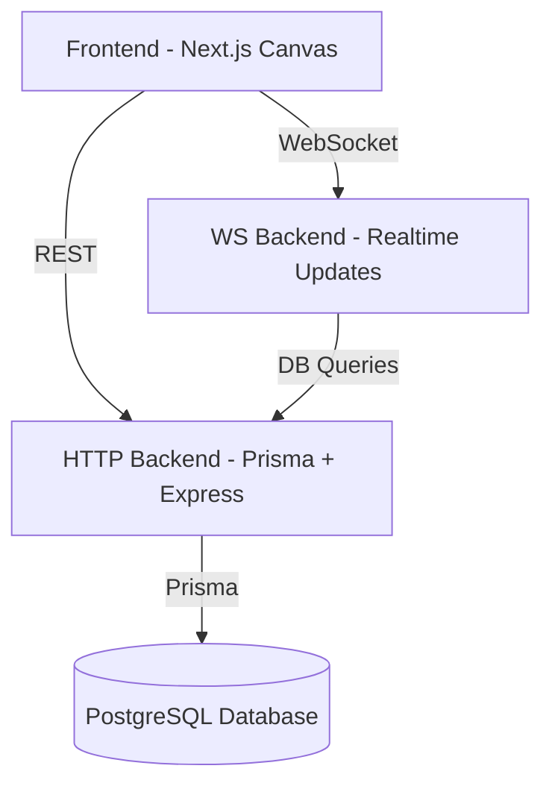

# 🎨 Draw App — Real-Time Collaborative Whiteboard

A powerful, modern real-time collaboration drawing system built using **Next.js**, **WebSockets**, **Express**, **Prisma**, and **Turborepo**.  
Draw App allows multiple users to sketch, brainstorm, and design together instantly on a shared canvas — with persistent storage and live sync.

---

## 🚀 Features

### ✏️ Drawing Tools
- Rectangle, Circle, Diamond  
- Pencil  
- Arrow  
- Text  
- Image insertion  
- Eraser  
- Undo / Redo (coming soon)

### ⚡ Real-Time Collaboration
- WebSocket-powered live drawing sync  
- Multi-user rooms  
- JWT-authenticated WebSocket connection  
- Cursor-based interactions (optional extension)

### 🗄️ Reliable Persistence
- All drawing operations are saved in PostgreSQL  
- Prisma-backed ORM  
- Efficient loading of existing shapes on room join  

### 🧩 Modular Architecture
- Turborepo-based monorepo  
- Shared backend utilities  
- Clean separation of concerns  

---

## 🌐 Live Architecture Overview



---

## 🏗️ Project Structure

```
.
├── apps/
│   ├── frontend/          → Next.js 15 collaborative canvas UI
│   ├── http-backend/      → Express API (Prisma CRUD)
│   ├── ws-backend/        → WebSocket real-time sync server
│
├── packages/
│   ├── db/                → Prisma schema + generated client
│   ├── ui/                → Shared UI components
│   ├── backend-common/    → Shared env + constants + JWT secret
│
├── docker-compose.yml      → Full stack container orchestration
└── turbo.json
```

---

## 🐳 Docker Setup (Production-Ready)

### 1️⃣ Start PostgreSQL first
```sh
cd packages/db
docker compose up -d
```

Run Prisma migration:
```sh
pnpm prisma db push
```

### 2️⃣ Start full stack
```sh
cd ../../
docker compose up --build
```

### Services:
| Service | URL |
|--------|-----|
| Frontend | http://localhost:8000 |
| HTTP Backend | http://localhost:4000 |
| WS Backend | ws://localhost:8088 |

---

## 💬 WebSocket Message Examples

### Join Room
```json
{
  "type": "join_room",
  "roomId": "abc-123"
}
```

### Send Shape Event
```json
{
  "type": "chat",
  "roomId": "abc-123",
  "message": "{"shape": {...}}"
}
```

---

## 📦 Tech Stack

### Frontend
- Next.js 15
- React 19
- Tailwind CSS
- Canvas API
- Framer Motion

### Backend
- Express.js
- WS WebSocket Server
- Prisma ORM
- PostgreSQL

### DevOps
- Docker
- Turborepo
- pnpm workspaces
- Vercel ready (optional)

---

## 🤝 Contributing

1. Fork the repo  
2. Create your feature branch  
3. Write clean commits  
4. Open a PR 😄  

---

## 📄 License

Licensed under the MIT License.

---

## 📎 Screenshots  

### UI Overview


 
---

## ⭐ Support the Project

If you like this project, star the repo — it helps a lot 🙌  
